# HΛDΞL

  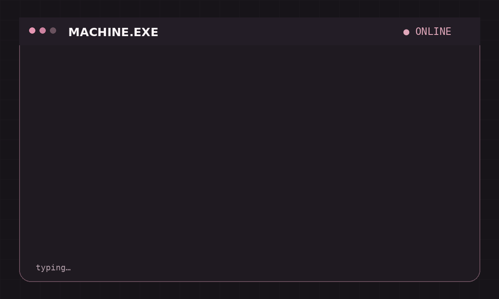

  <b>HΛDΞL × MACHINE</b> 
  building · thinking · experimenting · rebuilding

---

## SIGNAL

I build with **AI, data, computer vision, algorithms, and visual ideas**.

I like understanding how things work, turning ideas into experiments, and making technical systems feel alive.

---

  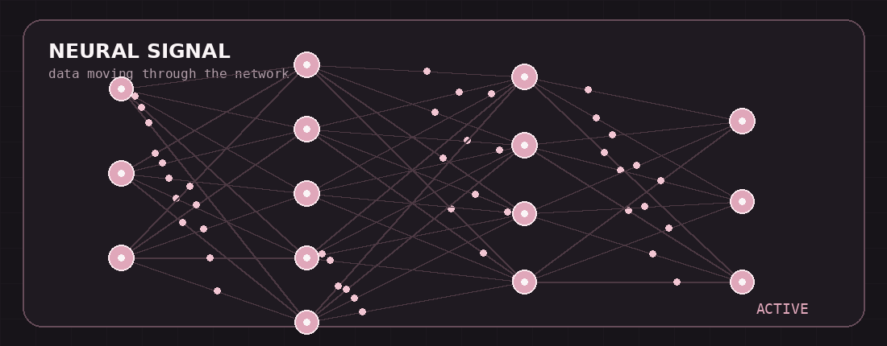

## HΛDΞL SYSTEM

  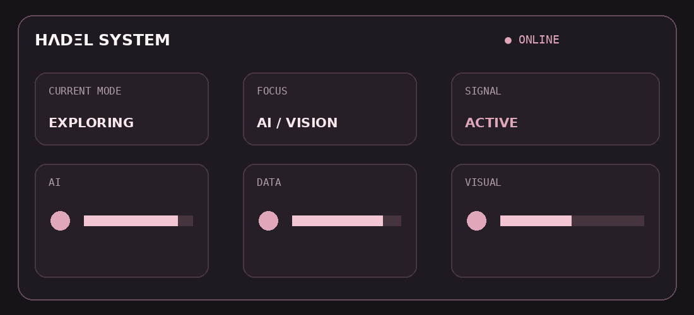

---

## TOOLBOX

**LANGUAGES**  

  &nbsp;&nbsp;
  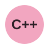&nbsp;&nbsp;
  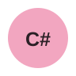&nbsp;&nbsp;
  &nbsp;&nbsp;
  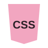&nbsp;&nbsp;
  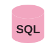

**AI & DATA**  

<code>Machine Learning</code>&nbsp;&nbsp;<code>Data Analysis</code>&nbsp;&nbsp;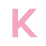

**VISION**  

<code>Computer Vision</code>&nbsp;&nbsp;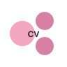&nbsp;&nbsp;<code>OCR</code>&nbsp;&nbsp;<code>Image Processing</code>

**TOOLS**  

  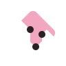&nbsp;&nbsp;
  &nbsp;&nbsp;
  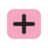&nbsp;&nbsp;
  &nbsp;&nbsp;
  <code>Kivy</code>

---

## CURRENTLY EXPLORING

`AI` · `Computer Vision` · `Algorithms` · `Photography` · `Visual Design`

---

## HOW I WORK

  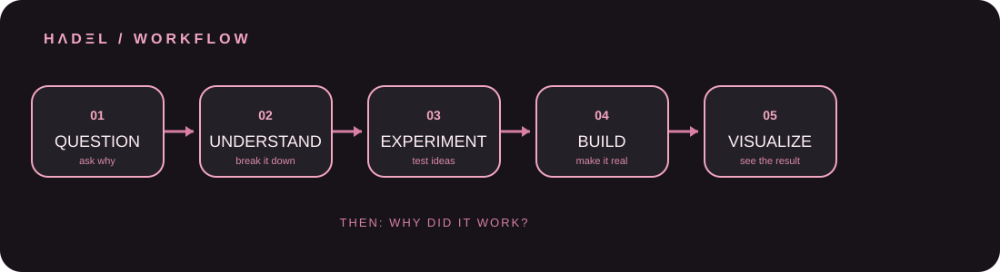

---

  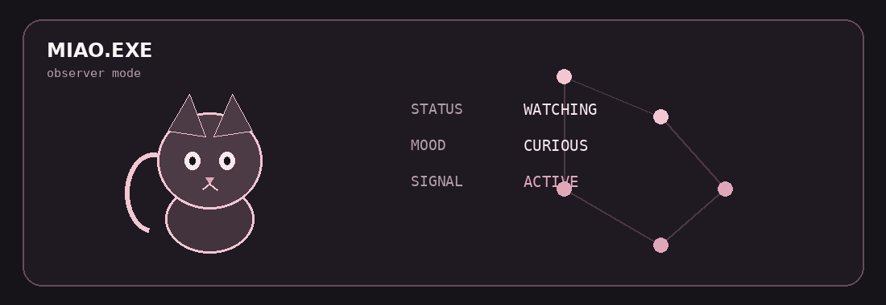

---

## CONNECT

  
  &nbsp;&nbsp;&nbsp;&nbsp;
  <a href="https://www.kaggle.com/hadeelalnomay">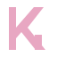</a>
  &nbsp;&nbsp;&nbsp;&nbsp;
  
  &nbsp;&nbsp;&nbsp;&nbsp;
  
  &nbsp;&nbsp;&nbsp;&nbsp;
  

---

  still curious.  
  <b>HΛDΞL</b> 
  BUILD · EXPLORE · UNDERSTAND

