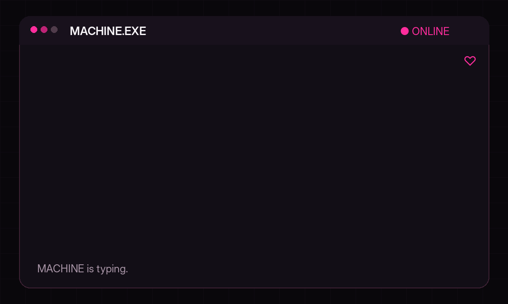
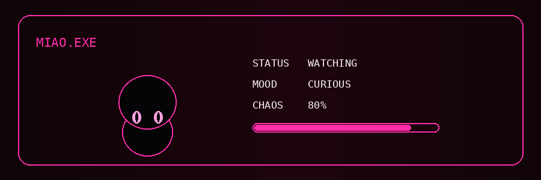
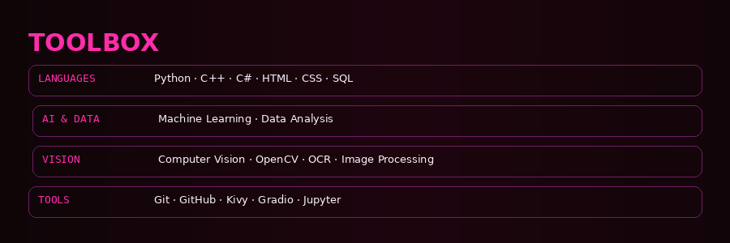
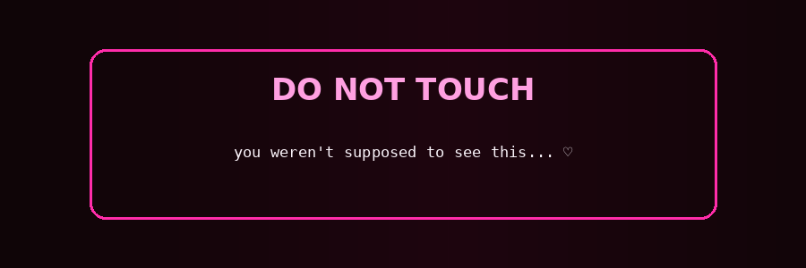

# HΛDΞL — PINK DIGITAL ROOM

<b>HΛDΞL × MACHINE</b> MADE IN 🇾🇪

<code>BUILDING</code> · <code>THINKING</code> · <code>EXPERIMENTING</code> · <code>REBUILDING</code>

---

## PRIVATE CONVERSATION

> **MACHINE:** Hadeel.  
> **HADEEL:** Yes?  
> **MACHINE:** What are you building?  
> **HADEEL:** Something.  
> **MACHINE:** Do you know what it does?  
> **HADEEL:** Not yet.  
> **MACHINE:** Then why did you build it?  
> **HADEEL:** Curiosity.  
> **MACHINE:** ...  
> **MIAO:** miao.  
> **MACHINE:** I don't trust the cat.  
> **HADEEL:** You shouldn't.  
> **MACHINE:** You started another project because you were curious?  
> **HADEEL:** Yes.  
> **MACHINE:** We already have 47 unfinished things.  
> **HADEEL:** Stop counting.  
> **MACHINE:** No.  
> **HADEEL:** You're becoming annoying.  
> **MACHINE:** I learned from you.  
> **HADEEL:** Excuse me?  
> **MACHINE:** Nothing.  
> **MACHINE:** You broke something.  
> **HADEEL:** I know.  
> **MACHINE:** Are you going to fix it?  
> **HADEEL:** No. I'm going to understand why it broke first.  
> **MACHINE:** That's inefficient.  
> **HADEEL:** That's learning.  
> **MACHINE:** What's next?  
> **HADEEL:** Something weird.  
> **MACHINE:** Define weird.  
> **HADEEL:** You'll know when you see it.  
> **MIAO:** miao.  
> **MACHINE:** She says we should go.  
> **HADEEL:** Miao doesn't pay the bills.  
> **MACHINE:** Neither do I.  
> **HADEEL:** Then get back to work.  
> **MACHINE:** Yes, boss.  

---

## SIGNAL

I build with code, data, AI, vision, and visual ideas.

I like understanding how things work, turning ideas into experiments, and making technical things feel alive.

---

## TOOLBOX

**LANGUAGES**  
`Python` · `C++` · `C#` · `HTML` · `CSS` · `SQL`

**AI & DATA**  
`Machine Learning` · `Data Analysis`

**VISION**  
`Computer Vision` · `OpenCV` · `OCR` · `Image Processing`

**TOOLS**  
`Git` · `GitHub` · `Kivy` · `Gradio` · `Jupyter`

---

## CURRENT OBSESSION ♡

`AI` · `Computer Vision` · `Algorithms` · `Photography` · `Visual Design`

---

## CONNECT

- GitHub — [HdlArf](https://github.com/HdlArf/HdlARF)
- Instagram — [@hdl_arf](https://www.instagram.com/hdl_arf/)
- LinkedIn — [Hadeel Hadeel](https://www.linkedin.com/in/hadeel-hadeel-10a449331/)
- Email — [hadeelalnomai@gmail.com](mailto:hadeelalnomai@gmail.com)

---

## MIAO'S WISHLIST ♡

**SHEIN** · *gift link to be decided later*

---

<b>FOLLOW HΛDΞL?</b> MADE IN 🇾🇪 · WITH CODE ♡

<b>HΛDΞL</b>

