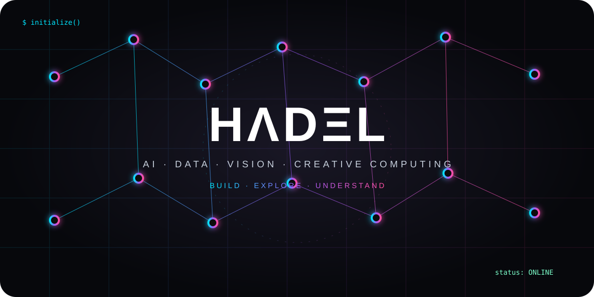
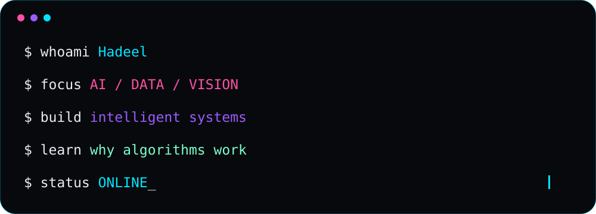
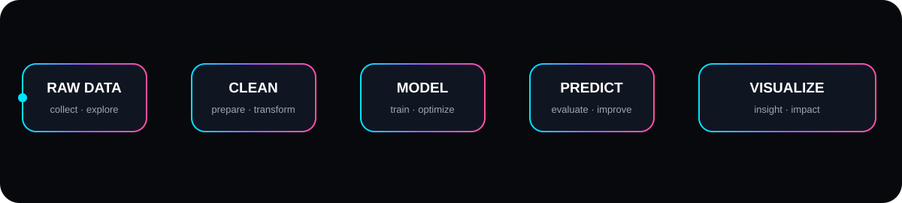
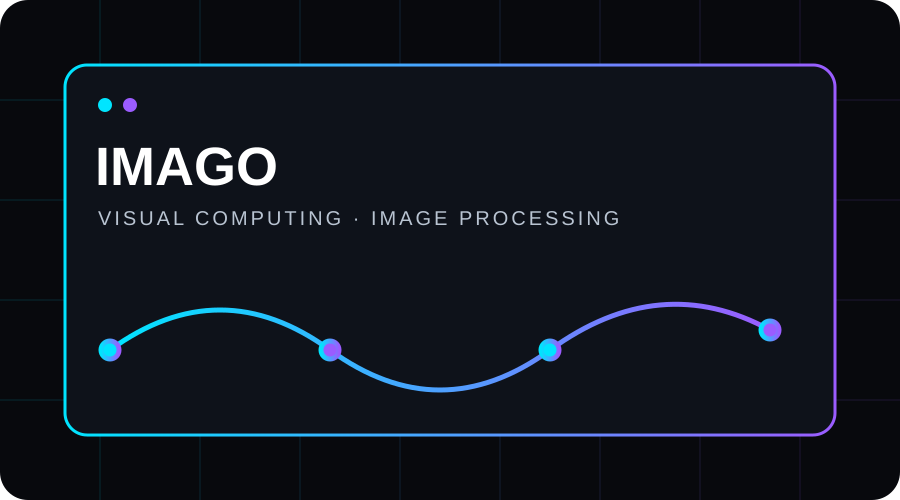
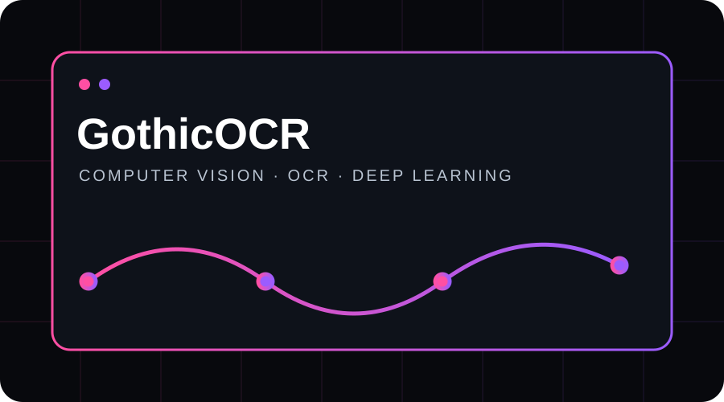
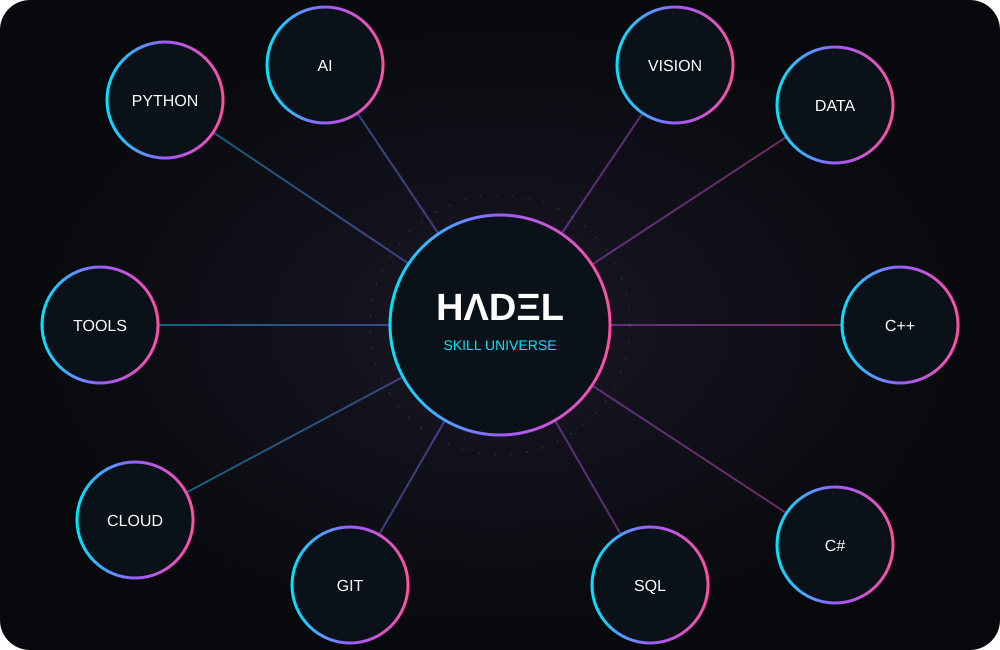

 

---

---

## SIGNAL

> I build at the intersection of **AI, data, computer vision, and creative computing**.
>
> I don't only ask *how* something works. I want to understand **why it was designed that way**.

🇾🇪 Yemen

---

---

# PROJECT SIGNALS

<table>
<tr>
<td width="50%" align="center">

**IMAGO**  
`Python` `Image Processing` `Computer Vision`

<a href="https://github.com/HdlArf/IMAGO_LAB">OPEN PROJECT →</a>

</td>
<td width="50%" align="center">

**GothicOCR**  
`Python` `OCR` `Deep Learning`

<a href="https://github.com/HdlArf/GothicOCR1">OPEN PROJECT →</a>

</td>
</tr>
</table>

---

---

## HOW I THINK

### QUESTION → UNDERSTAND → EXPERIMENT → BUILD → VISUALIZE → WHY?

---

## GITHUB SIGNAL

---

## AI OVERLOAD?

**TAKE A BREAK.**

  

`meow.`

  

# HΛDΞL

`BUILD · EXPLORE · UNDERSTAND`

