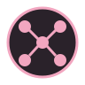
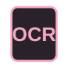
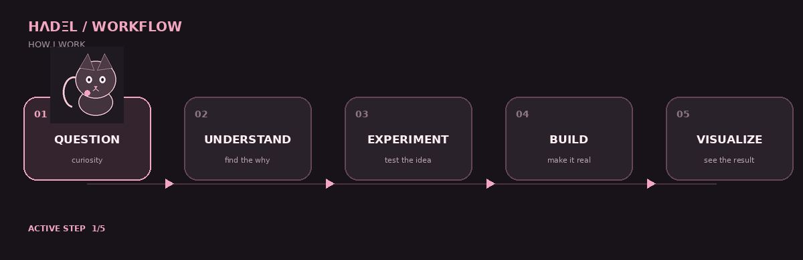

# HΛDΞL

  

  <b>HΛDΞL × MACHINE</b> 
  building · thinking · experimenting · rebuilding

---

## SIGNAL

I build with **AI, data, computer vision, algorithms, and visual ideas**.

I like understanding how things work, turning ideas into experiments, and making technical systems feel alive.

---

  

## HΛDΞL SYSTEM

  

---

## TOOLBOX

**LANGUAGES**  

  &nbsp;&nbsp;&nbsp;
  &nbsp;&nbsp;&nbsp;
  &nbsp;&nbsp;&nbsp;
  &nbsp;&nbsp;&nbsp;
  &nbsp;&nbsp;&nbsp;
  

**AI & DATA**  

  &nbsp;&nbsp;&nbsp;
  &nbsp;&nbsp;&nbsp;
  

Machine Learning&nbsp;&nbsp;&nbsp; Data Analysis&nbsp;&nbsp;&nbsp; Kaggle

**VISION**  

  &nbsp;&nbsp;&nbsp;
  &nbsp;&nbsp;&nbsp;
  &nbsp;&nbsp;&nbsp;
  

Computer Vision&nbsp;&nbsp;&nbsp; OpenCV&nbsp;&nbsp;&nbsp; OCR&nbsp;&nbsp;&nbsp; Image Processing

**TOOLS**  

  &nbsp;&nbsp;&nbsp;
  &nbsp;&nbsp;&nbsp;
  &nbsp;&nbsp;&nbsp;
  &nbsp;&nbsp;&nbsp;
  

Git&nbsp;&nbsp;&nbsp; GitHub&nbsp;&nbsp;&nbsp; Gradio&nbsp;&nbsp;&nbsp; Kivy&nbsp;&nbsp;&nbsp; Jupyter

---

## CURRENTLY EXPLORING

`AI` · `Computer Vision` · `Algorithms` · `Photography` · `Visual Design`

---

## HOW I WORK

  

---

  

---

## CONNECT

  
  &nbsp;&nbsp;&nbsp;&nbsp;
  
  &nbsp;&nbsp;&nbsp;&nbsp;
  
  &nbsp;&nbsp;&nbsp;&nbsp;
  
  &nbsp;&nbsp;&nbsp;&nbsp;
  

---

  still curious.  
  <b>HΛDΞL</b> 
  BUILD · EXPLORE · UNDERSTAND

